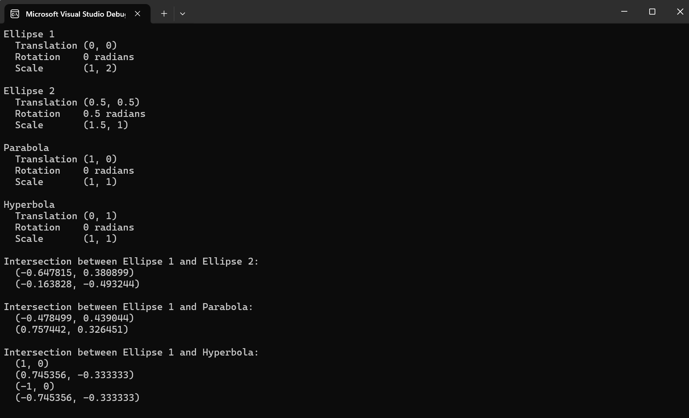

# Conic Intersection

This project computes the intersection points of conic sections (ellipses, hyperbolas, parabolas, and circles) using algebraic geometry techniques. It leverages the concept of a pencil of conics and degenerate conics to find intersections efficiently and accurately.

## Features

### Conic Intersection Computation
- Finds intersection points between any two conic sections.
- Uses the pencil of conics method to reduce the problem to solving simpler equations.
- Automatically handles degenerate conics such as intersecting lines, tangent lines, or coincident conics.

### Accurate and Robust
- Computes intersections algebraically for precision.
- Detects special cases like tangency and overlapping conics.
- Avoids numerical instability in standard geometric configurations.

